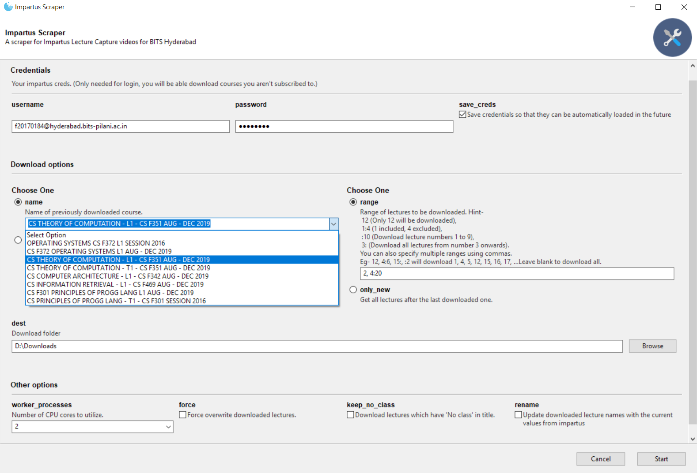

# Impartus Scraper

This is a scraper for the Impartus Lecture Capture system deployed in BITS Pilani Hyderabad Campus. No more crying when Impartus servers crash during exam time because of overload. You can even access lectures from previous years in case your current prof sucks :P

## Features
* Awesome GUI!
	
* Download lectures without subscribing to them.
* Specify ranges to limit the lectures to be downloaded.
* Fuzzy searching of course names.
* Skips already downloaded lectures.
* Multiprocessing support.

## Installation
**Recommended:** Go to the [Releases](https://github.com/iamkroot/ilc-scraper/releases) page and download the latest version according to your OS. Just double click and run!

**Manual method:**
1. Ensure you have [Python 3.6](https://www.python.org/downloads/) or higher installed, and available in your system `PATH`. To check, run `python --version` from command line/terminal.
2. Install `ffmpeg` from [here](http://ffmpeg.org/download.html). Ensure it is in your PATH variable. To check, run `ffmpeg -version` from command line/terminal.
3. Install [poetry](https://github.com/sdispater/poetry) using `pip install --user poetry`. Restart your PC.
4. Clone this repo if you know git, or click [`Download as ZIP`](https://github.com/iamkroot/ilc-scraper/archive/master.zip) and extract it to some location.
5. Open terminal and cd to download/clone directory.
6. Run `poetry install --no-dev -E gui` for the default installation. (If you don't want the GUI, which takes up a lot of extra space, omit the `-E gui` from the command.)

## Configuration (Optional)
In case you plan to use the script multiple times, it'll be useful to not have to type the Impartus creds and download location everytime. You can store these for future use.
1. Duplicate the [`sample_config.json`](sample_config.json) file and rename it to `imp_config.json`.
2. Enter your Impartus credentials (Username, Password) in the fields. Required to be able to access Impartus.
3. Specify the Download Location for the lectures in the `save_fold` field. If you leave this blank, it will default to `Impartus Lectures` folder inside the download location of this script.

**IMP**: For Windows, you need to use double `\\` in paths. Eg: `C:\\Users\\Student\\Downloads\\Lectures` or `D:\\Impartus`.

## Running (manual method)
* GUI: Run `poetry run python ilc_scrape.py` and enter the details as asked (See [Help](#help) section). For the first time, you will need to specify the full URL of the course. For future uses, you can select the course names from the dropdown.
* Command line: Pass argument flags to the script. Eg: `poetry run python ilc_scrape.py -n "operating systems" -r 14:16,25 -f` will force download lecture numbers 14, 15 and 25 of OS lectures. See `python ilc_scrape.py -h` to see all available options. If you have the GUI installed, but still wanna use the command line, add `--ignore-gooey` to the command at the end. This will disable the GUI.

## How it works
* The script simply exploits the fact that the Impartus API for retrieving the lecture info for a course does not check if the user is subscribed to it. Then its a simple task to loop over the lectures and download their video streams.

* All the videos are available as HLS Streams, which are downloaded using `ffmpeg`.

* The fuzzy search for matching the course names works using [`difflib`](https://docs.python.org/3/library/difflib.html) module. For the first time when the course URL is specified, it is added to a local database, along with its full name. These full names are then compared against the given query and the most similar full name is chosen.

* The GUI is made using [Gooey](https://github.com/chriskiehl/Gooey), which makes it dead simple to convert CLI Python apps to full featured GUIs.

## Help
### Specifying Ranges
The range pattern follows the format of Python Slices.
```
12 (Only 12 will be downloaded),
1:4 (1 included, 4 excluded),
:10 (Download lecture numbers 1 to 9),
3: (Download all lectures from number 3 onwards). 
```

You can also specify multiple ranges using commas. 
`12, 4:6, 15:, :2` will download lectures 1, 4, 5, 12, 15, 16, 17, ... until the latest one.

## Authors
* [Krut Patel](https://github.com/iamkroot) 
